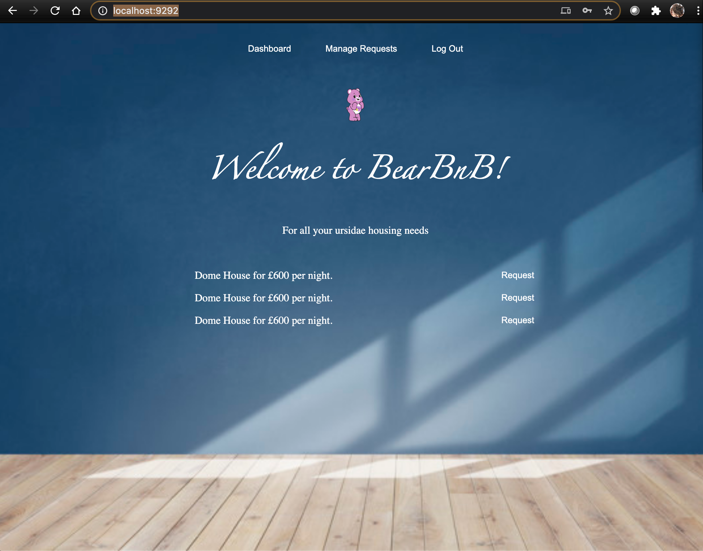

# BearBnB

Welcome to BearBnB. A webapp that allows users to request from available spaces, upload your available personal spaces together and manage bookings.

## Languages and frameworks
* Ruby
* Sinatra
* PostgresQL
* Bcrypt

## Getting started

    fork this repo  
    git clone path-to-your-repo  
    bundle install

## Local Database Setup

## Users Stories Implemented

    As a user
    So I can request spaces
    I would like be able to sign up

    As a user
    So I can view my listings
    I would like to sign in 

    As a user
    So no one can create listings on my account
    I would like to be able to sign out

    As a user
    So that I can see what spaces are available
    I would to see a list of spaces

    As a user
    So I can book a space
    I want to be able to request a booking

## Specifications

* Any signed up user can list a space  
* Users can list multiple spaces  
* Users should be able to name their space, provide a short description of the space and a price for the night  
* Users should be able to offer a range of dates when their space is available  
* Any signed up user can request to hire any space for a night, and this should be approved by the user who owns the space  
* Nights for which a space has already been booked should not be available for users to book that space  
* Until a user has confirmed a booking request that space can still be booked for that night  

